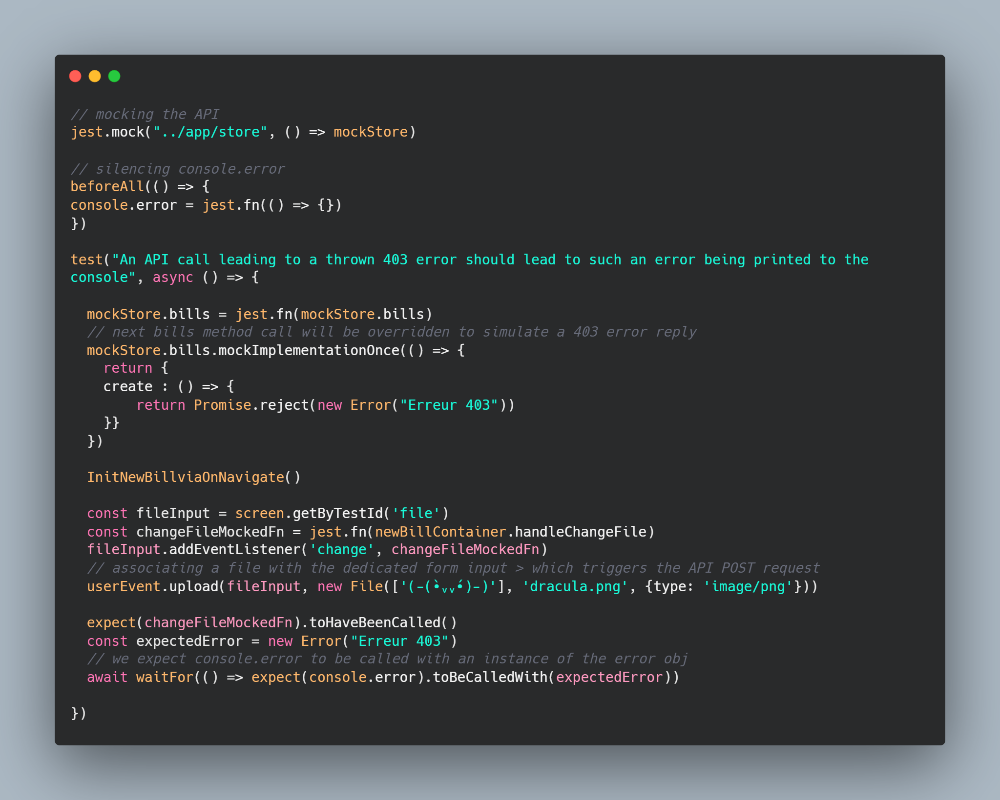

This app is meant to give some employees a way to manage the expense reports of a company.

Besides a few bugs I had to handle, the backend and the frontend were delivered to me as is.

My job here consisted of implementing all the tests needed to assess the behavior of the employee dashboard functionalities.

Using Jest I had to deal with :

- Rejected promises,
- Thrown errors,
- Some complex routing,
- A mocked API,
- A mocked localStorage,
- ...

It wasn't an easy task since I did my best to stick to the user workflow (which adds a lot of complexity to the process) despite the lack of online documentation to help you tackle .

One of the most interesting test has to be that one :

