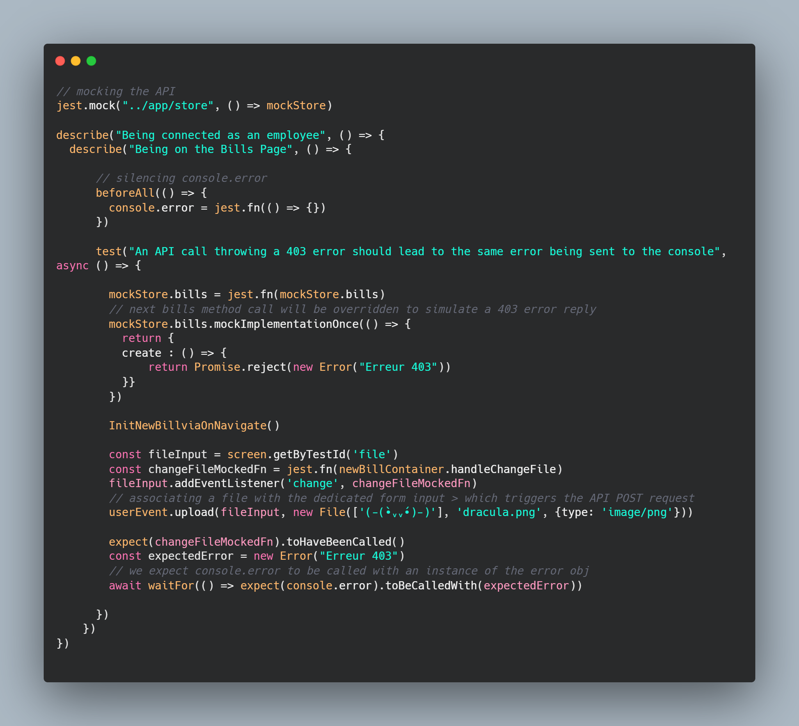

This app is meant to give some employees a way to manage the expense reports of a company.

Besides a few bugs I had to handle, the backend and the frontend were delivered to me as is.

My job here consisted of implementing all the tests needed to assess the behavior of the employees dashboard functionalities.

Using Jest I had to deal with :

- Rejected promises,
- Thrown errors,
- Some complex routing,
- A mocked API,
- A mocked localStorage,
- ...

It wasn't an easy feat since my objective was to stick as much as possible to the real user workflow. A lack of documentation and the need of a deep understanding of some javascript core concepts made this task a hard one to tackle.

One of the most interesting test has to be that one :

